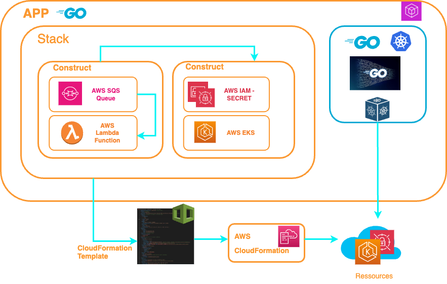

  


SonarQube is a powerful code quality management tool that helps developers identify and correct code quality and security issues.
This tutorial aims to show you how to set up SonarQube on AWS Elastic Container Service (ECS) Fargate. Throughout this guide, we'll walk you through the steps of deploying SonarQube in an ECS Fargate environment using AWS CDK with Golang.

The AWS CDK lets you build reliable, scalable, cost-effective applications in the cloud with the considerable expressive power of a programming language.
A CloudFormation template is generated for each deployment.




This deployment is the extraction of a larger deployment that included several ECS Fargate servers as well as several sonarqube instances and sonarqube databases on an RDS instance.


## Prerequisites

Before you get started, you’ll need to have these things:

* AWS account
* SSO Login or not
* [AWS CLI V2](https://docs.aws.amazon.com/cli/latest/userguide/getting-started-install.html)
* [AWS Cloud Development Kit (AWS CDK) v2](https://docs.aws.amazon.com/cdk/v2/guide/getting_started.html)
* [Go language installed](https://go.dev/)
* [Node.jjs installed](https://nodejs.org/en)
* A AWS VPC
* A AWS Security Group
* bash version 4+

When setting up a new AWS environment for our project, one of the first things you'll need to do is create a VPC.
When setting up the VPC, it is essential to configure security groups to control inbound and outbound traffic to and from the VPC. Security groups act as virtual firewalls, allowing only authorized traffic to pass through.
The ports to be authorized (defined in the Security Groups) for input/output are : 9000 (sonarqube default port) , 2049 (EFS Volume) 

We'll use the same VPC and Security Group to deploy the PostgreSQL RDS instance and our SonarQube workload.

## Steps

### ✅ Set Config AWS Profil

The `config_crd.json` Contains the parameters to be initialized to AWS Profil 

```
config_crd.json :

Region:  Deployment region	        
Account: AWS account number
SSOProfile: AWS SSO Profile using
Index: Number to generate a name for the RDS Instance,AWS Secret, Stacks .... :
      <NAME+INDEX>
VPCid: AWS VPC using
SecurityGroupID : AWS Security Group using
```    
❗️ You must initialize these variables with your informations.

## Created a ECS Task Execution Role

go to directory [deployrole](deployrole) (please read the README.md)


## Deploy AWS ECS Fargate cluster.

go to directory [ecs](ecs) (please read the README.md)

### Deploy AWS RDS PostgreSQL.

go to directory [database](database) (please read the README.md)


## Deploy AWS Lambda function 

go to directory [createdb](createdb) (please read the README.md)

## Deploy SonarQube

go to directory [sonarqube](sonarqube) (please read the README.md)


---

## ✅ Conclusion

In summary, AWS ECS Fargate simplifies the deployment, management, and scalability of SonarQube, offering a cost-effective and efficient solution for teams looking to analyze and improve their code quality.

AWS ECS Fargate provides : 

    1️⃣ Ease of Deployment:
        ECS Fargate abstracts away the underlying infrastructure, making it easier to deploy and manage SonarQube without having to worry about server provisioning and maintenance.

    2️⃣ Resource Efficiency:
        Fargate allows you to run SonarQube in a serverless manner, enabling automatic scaling based on demand. This ensures that you only pay for the resources you consume, optimizing costs.

    3️⃣ Isolation and Security:
        Fargate provides containerization, ensuring that SonarQube runs in isolated environments. This enhances security by minimizing the attack surface and reducing the impact of potential vulnerabilities.

    4️⃣ Managed Service:
        With ECS Fargate, AWS takes care of the underlying infrastructure, including server provisioning, patching, and updates. This allows your team to focus more on SonarQube configuration and usage, rather than infrastructure management.

    5️⃣ Scalability:
        Fargate allows you to easily scale your SonarQube application up or down based on workload, ensuring optimal performance during peak times and cost savings during periods of low demand.

    6️⃣ Integration with AWS Ecosystem:
        SonarQube on ECS Fargate integrates seamlessly with other AWS services, such as Amazon RDS for database management, Amazon S3 for storage, and AWS Identity and Access Management (IAM) for security, providing a cohesive and well-integrated solution.

    7️⃣ Automatic Load Balancing:
        ECS Fargate supports integration with Elastic Load Balancing (ELB), allowing for automatic distribution of incoming traffic across multiple instances of SonarQube. This enhances the availability and reliability of your application.


---
# Next steps

At this stage the sonarqube deployment provides a public address ip, in a next step I'll do the integration in a dns domain and https access with certificate.

- create a DNS sub-domain
- Create a ssl certification 
- integration in cloudfront

---

## ✅ Ressources

▶️ [awscdk go package](https://pkg.go.dev/github.com/aws/aws-cdk-go/awscdk/v2#section-readme) 

▶️ [awsiam go package](https://pkg.go.dev/github.com/aws/aws-cdk-go/awscdk/v2@v2.102.0/awsiam#section-readme)

▶️ [awsec2 go package](https://pkg.go.dev/github.com/aws/aws-cdk-go/awscdk/v2/awsec2#section-readme)
