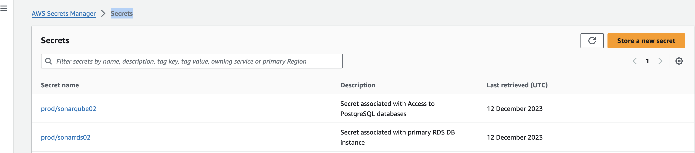

 


# Welcome to your CDK Deployment with Go.

The purpose of this deployment is to run an AWS RDS PostgreSQL instance.


* The `cdk.json` file tells the CDK toolkit how to execute your app.
* The `config.json` Contains the parameters to be initialized to deploy the task :
```
Config.json :

    SecretName:             Secret name for RDS database access
	DescSecret:	            Description : Secret associated with primary RDS DB instance: DBSonar01
	Instanceclass:          Instance class
	Version:		        Version of PostgreSQL
	DBsize:			        DB size
	Engine:                 postgres
	BackupRetentionPeriod:  1
	DBName:                 dbname instance
	DBPort:                 DB Port
	MasterUsername :        default postgres
	MasterUserPassword:     master password,
	SubnetGroup:            the subnet group to use
	SecretNameSonarqube :   secret name to store access sonarqube
	SonarqubeUserPassword: sonarqube db password
	SonarqubeDescSecret:   Description Secret associated with Access to PostgreSQL databases partner
```    


## What does this task do?

- Create a Subnet Group for RDS instance
- Create a secret RDS DB instance
- create a secret for sonarqube database
- Deploy AWS RDS PostgreSQL instance

## ✅ Useful commands

 * `./cdk.sh deploy`      deploy this stack to your default AWS account/region
 * `./cdk.sh destroy`     cleaning up stack

## Setup Environment

Run the following command to automatically install all the required modules based on the go.mod and go.sum files:

```bash
AWS_ECS_FARGATE_SONARQUBE:/database/> go mod download

```
## ✅ Deploying your RDS instance

Let’s deploy a RDS database! When you’re ready, run **cdk deploy**

```bash
AWS_ECS_FARGATE_SONARQUBE:/database/> ./cdk.sh deploy


✨  Synthesis time: 3.37s

DatabaseStack02:  start: Building 4b12afdaff74ab7e046b151a548bca7f06ddb3b50e3a055d13c2e305ea43e48d:xxxxx-eu-central-1
DatabaseStack02:  success: Built 4b12afdaff74ab7e046b151a548bca7f06ddb3b50e3a055d13c2e305ea43e48d:xxxxx-eu-central-1
DatabaseStack02:  start: Publishing 4b12afdaff74ab7e046b151a548bca7f06ddb3b50e3a055d13c2e305ea43e48d:xxxxx-eu-central-1
DatabaseStack02:  success: Published 4b12afdaff74ab7e046b151a548bca7f06ddb3b50e3a055d13c2e305ea43e48d:xxxxx-eu-central-1
DatabaseStack02: deploying... [1/1]
DatabaseStack02: creating CloudFormation changeset...

 ✅  DatabaseStack02

✨  Deployment time: 418.42s

Stack ARN:
arn:aws:cloudformation:eu-central-1:xxxxxxx:stack/DatabaseStack02/3b4a8020-9883-11ee-94bb-028fc9ed33d3

✨  Total time: 421.79s

✅  Secretup02 

✨  Deployment time: 0.52s

Outputs:
Secretup02.RdsEndpoint2 = dbsonar-02.cm9tnlr4x0ln.eu-central-1.rds.amazonaws.com
Stack ARN:
arn:aws:cloudformation:eu-central-1:xxxxx:stack/Secretup02/21318710-9b35-11ee-8f9e-0af589c66851

✨  Total time: 5.74s

```

On your AWS management console, you can now see your RDS instance (go in RDS console):


On your AWS management console ,you can check that the secrets are well created ( go in Secrets Manager console )


-----
<table>
<tr style="border: 0px transparent">
	<td style="border: 0px transparent"> <a href="../ecs/README.md" title="Creating ECS Fargate cluster">⬅ Previous</a></td><td style="border: 0px transparent"><a href="../createdb/README.md" title="Creating a sonarqube database">Next ➡</a></td><td style="border: 0px transparent"><a href="../README.md" title="home">🏠</a></td>
</tr>
<tr style="border: 0px transparent">
<td style="border: 0px transparent">ECS Fargate cluster</td><td style="border: 0px transparent">Sonarqube database</td><td style="border: 0px transparent"></td>
</tr>

</table>
