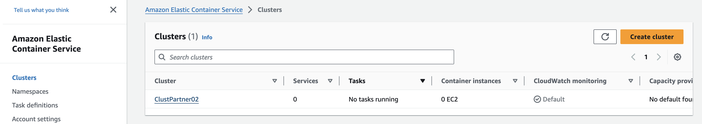

 


# Welcome to your CDK Go project!

The purpose of this deployment is to run an ECS Fargate cluster.

* The `cdk.json` file tells the CDK toolkit how to execute your app.
* The `config.json` Contains the parameters to be initialized to deploy the task :
```
config.json :

	ClusterName     ECS Cluster name
```


## What does this task do?

- Deploy ECS Fargate Cluster

## ✅ Useful commands

 * `cdk deploy`      deploy this stack to your default AWS account/region
 * `cdk destroy --force`     cleaning up stack

## Setup Environment

Run the following command to automatically install all the required modules based on the go.mod and go.sum files:

```bash
AWS_ECS_FARGATE_SONARQUBE:/ecs/>  go mod download
```
## ✅ Deploying your cluster

Let’s deploy a cluster! When you’re ready, run **cdk deploy**

```bash
AWS_ECS_FARGATE_SONARQUBE:/ecs/>  cdk deploy

  Synthesis time: 3.14s

EcsStack02:  start: Building fe4321cb799798100d1b63790f9c853a30ee671e2483c705023b4acefe06d9a5:103078382956-eu-central-1
EcsStack02:  success: Built fe4321cb799798100d1b63790f9c853a30ee671e2483c705023b4acefe06d9a5:103078382956-eu-central-1
EcsStack02:  start: Publishing fe4321cb799798100d1b63790f9c853a30ee671e2483c705023b4acefe06d9a5:103078382956-eu-central-1
EcsStack02:  success: Published fe4321cb799798100d1b63790f9c853a30ee671e2483c705023b4acefe06d9a5:103078382956-eu-central-1
EcsStack02: deploying... [1/1]
EcsStack02: creating CloudFormation changeset...

 ✅  EcsStack02

✨  Deployment time: 16.84s

Stack ARN:
arn:aws:cloudformation:eu-central-1:xxxxxxx:stack/EcsStack02/d7a9a3e0-9862-11ee-83fa-064fc08bbe33

✨  Total time: 19.98s

``` 
On your AWS management console, you can now see your ECS Cluster (go in Elastic Container Service console):



-----
<table>
<tr style="border: 0px transparent">
	<td style="border: 0px transparent"> <a href="../deployrole/README.md" title="Created Task Execution Role">⬅ Previous</a></td><td style="border: 0px transparent"><a href="../database/README.md" title="Creating a AWS RDS instance">Next ➡</a></td><td style="border: 0px transparent"><a href="../README.md" title="home">🏠</a></td>
</tr>
<tr style="border: 0px transparent">
<td style="border: 0px transparent">Task Execution Role</td><td style="border: 0px transparent">Creating RDS instance</td><td style="border: 0px transparent"></td>
</tr>

</table>
