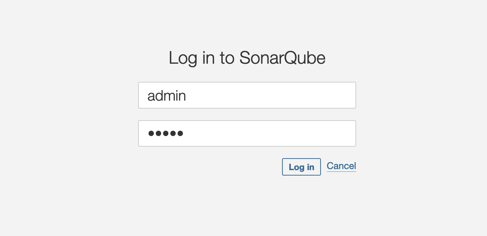
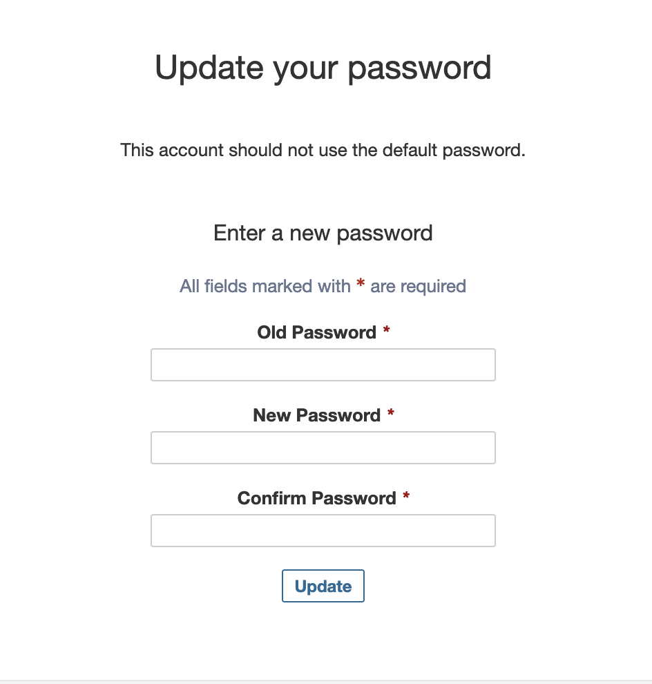
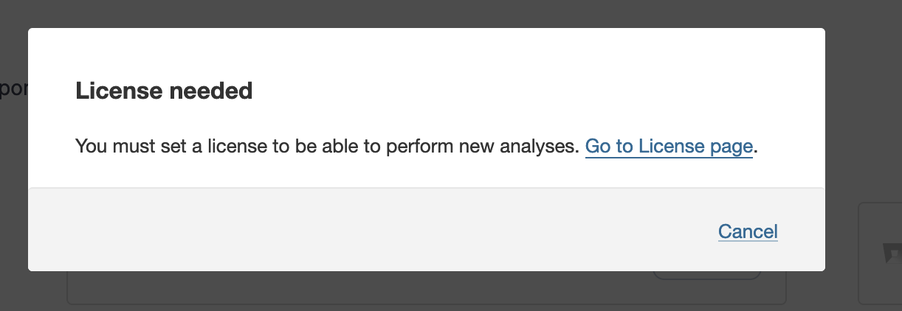
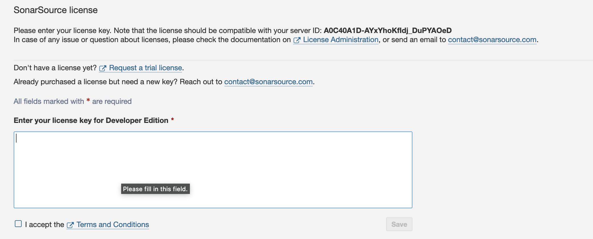

 


# Welcome to your CDK Deployment with Go.

* The `cdk.json` file tells the CDK toolkit how to execute your app.
* The `Config.json` Contains the parameters to be initialized to deploy the task :


```
Config.json :

    SecretNameSonarqube secret name to store access sonarqube
	Endpoint            EndPoint to access RDS Instance
	SonarvolumeName1    EFS Volume Data
	SonarvolumeName2    EFS Volume Log
	ClusterName         ECS Cluster name
	SonarImages         Sonar docker image
	Urlconnect          jdbc url indice : **jdbc:postgresql://**
	UriDatabaseType     postgres
	DesiredCount        count deployment
	Cpu                 CPU number
	MemoryLimitMiB      Memory size
	Taskname            Task name
```

❗️Depending on your AWS access configuration, you may need to adapt the code in **sonarqube.go** in the **Set Inbound Rules** section if you want to add ingress access rules (such as the SonarQube listening port 9000 and the storage listening port 2049). Alternatively, you can implement these rules directly in the Security Group that you are using.

## What does this task do?

- Provision of 2 EFS volumes
- Create a task in ECS Fargate cluster
- Deploy sonarqube
- Provision an external ip address : to connect to sonarqube


## ✅ Useful commands

 * `./cdk.sh deploy`      deploy this stack to your default AWS account/region
 * `./cdk.sh destroy`     cleaning up stack

## ✅ Setup Environment

Run the following command to automatically install all the required modules based on the go.mod and go.sum files:

```bash
AWS_ECS_FARGATE_SONARQUBE:/sonarqube/> go mod download

```
## ✅ Deploying SonarQube

Let’s deploy a SonarQube! When you’re ready, run **cdk.sh deploy**

```bash
AWS_ECS_FARGATE_SONARQUBE:/sonarqube/> ./cdk.sh deploy

✅  SonarqubeStack02

✨  Deployment time: 164.06s

Stack ARN:
arn:aws:cloudformation:eu-central-1:xxxxxstack/SonarqubeStack02/75d22490-9ea6-11ee-abb5-02cf4265638b

✨  Total time: 168.71s


✅  GetPublicIP02

✨  Deployment time: 16.89s

Outputs:
GetPublicIP02.SonarQubeEndPoint = http://X.X.X.X:9000
Stack ARN:
arn:aws:cloudformation:eu-central-1:xxxxx:stack/GetPublicIP02/fb7c04c0-9ea7-11ee-b29d-029678f61543

✨  Total time: 20.45s

```

You'll have to wait a few minutes for the External address to be bindered :
**GetPublicIP02.SonarQubeEndPoint = http://X.X.X.X:9000**

😀 Now you can connect to the SonarQube instance at the following url sample:

http://X.X.X.X:9000


 

Default admin credentials
When installing SonarQube, a default user with Administer System permission is created automatically:

* Login: admin
* Password: admin

The first time you connect to intense sonarqube, you must change the administrator password:
 


❗️ If you are using a Developer or Enterprise version of sonarqube, before proceeding to the next step you must enter the license number.
Go to menu  **Administration/Configuration/License Manager**

 

  


-----
<table>
<tr style="border: 0px transparent">
	<td style="border: 0px transparent"> <a href="../createdb/README.md" title="Creating a sonarqube databaser">⬅ Previous</a></td><td style="border: 0px transparent"><a href="../README.md" title="home">🏠</a></td>
</tr>
<tr style="border: 0px transparent">
<td style="border: 0px transparent">Creating a sonarqube database</td><td style="border: 0px transparent">Home</td><td style="border: 0px transparent"></td>
</tr>

</table>
